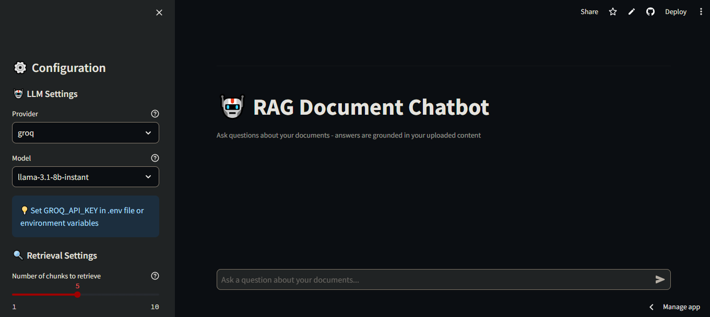
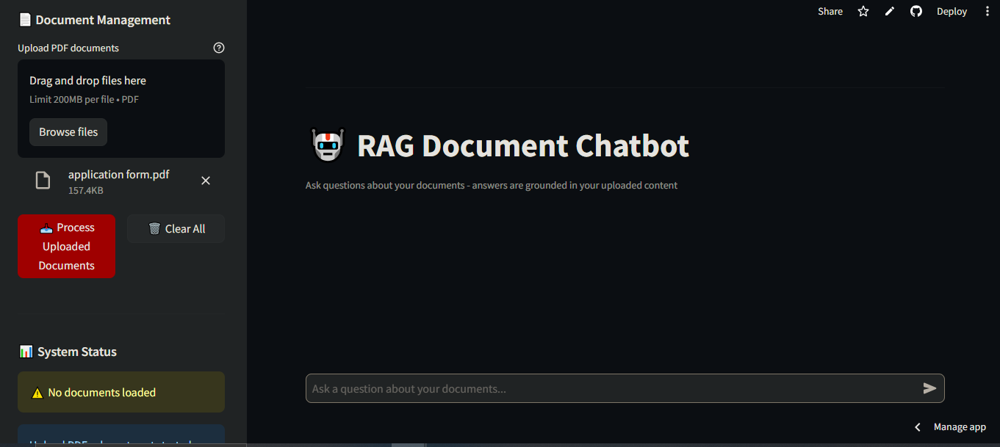
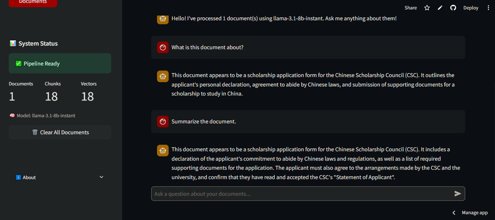
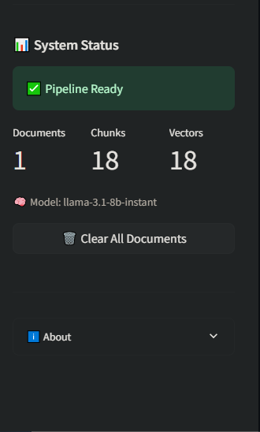

# 📄 RAG Document Chatbot (v2 - FAISS Upgrade + Modular RAG Pipeline)


---

# 🚀 Live Demo

## 🌐 Deployed Application

👉 **Live App:**
[https://jay-rag-chatbot.streamlit.app/](https://jay-rag-chatbot.streamlit.app/)

---

## 🎥 Video Demonstration

[https://github.com/jaymwangi/document-ai-chatbot/blob/main/assets/demo/rag_doc_chatbot_demo.mp4](https://github.com/jaymwangi/document-ai-chatbot/blob/main/assets/demo/rag_doc_chatbot_demo.mp4)

---

# 📌 Project Evolution (IMPORTANT UPDATE)

> ⚠️ This repository has been **significantly upgraded from an earlier version**.

### 🔄 Major Upgrade Includes:

* Migrated from **basic vector similarity (NumPy cosine)** → **FAISS indexing system**
* Introduced **modular RAG architecture (pipeline/orchestrator design)**
* Added **retrieval debugging system with metadata visibility**
* Implemented **performance timing logs across all pipeline stages**
* Enhanced **retriever with scoring + source tracking**
* Improved **UI/UX with real-time processing feedback + debug panel**
* Optimized ingestion pipeline for **large document handling (1000+ chunks)**

---

# 📌 Overview

The **RAG Document Chatbot** is a full-stack AI application that enables users to upload PDF documents and ask natural language questions grounded in the uploaded content.

The system implements a **Retrieval-Augmented Generation (RAG)** pipeline that combines:

* semantic retrieval
* FAISS vector similarity search
* contextual document grounding
* LLM-powered response generation

Unlike traditional chatbots that rely purely on prompting, this system retrieves relevant document context before generating responses, significantly improving factual accuracy and explainability.

---

# 🧠 Key Features

* 📄 PDF upload and parsing
* ✂️ Intelligent overlapping text chunking
* 🧠 Sentence-transformer embeddings
* ⚡ FAISS vector indexing (fast similarity search)
* 🔍 Semantic retrieval with scoring + metadata
* 🧾 Retrieval debug panel (inspect chunks + scores)
* ⏱️ Pipeline timing logs (performance tracing)
* 🤖 Groq/OpenAI LLM integration
* 📚 Source-grounded responses
* 💬 Interactive Streamlit chat interface
* 🧩 Modular production-style RAG architecture

---

# 📸 Application Screenshots

---

## 🏠 Homepage / Empty State

* clean UI
* sidebar controls
* upload workflow
* configurable retrieval settings



---

## 📄 Document Upload & Processing

* PDF ingestion
* real-time processing
* document management workflow



---

## 💬 Question & Answer Interaction

* grounded response generation
* contextual answering
* FAISS-powered retrieval in action



---

## 📚 Retrieval Debug Panel

* retrieved chunks
* similarity scores
* source tracking
* explainable AI workflow visibility



---

# 🏗️ System Architecture

```text
User Query
    ↓
Streamlit Frontend (app.py)
    ↓
RAG Orchestrator (pipeline/orchestrator.py)
    ↓
Query Embedding (Sentence Transformers)
    ↓
FAISS Vector Search Engine
    ↓
Top-K Relevant Chunks + Scores
    ↓
LLM Generator (Groq/OpenAI)
    ↓
Grounded Final Response
```

---

# ⚙️ How the RAG Pipeline Works

## 1️⃣ Document Upload

Users upload PDF documents through the Streamlit interface.

## 2️⃣ PDF Text Extraction

Extracted using PyPDF loader.

## 3️⃣ Intelligent Chunking

Overlapping chunks preserve semantic continuity.

## 4️⃣ Embedding Generation

Sentence Transformers convert text → vectors.

## 5️⃣ FAISS Indexing

Vectors are stored in FAISS for efficient similarity search.

## 6️⃣ Query Embedding

User query is embedded into same vector space.

## 7️⃣ Semantic Retrieval

FAISS returns top-K most similar chunks with scores.

## 8️⃣ LLM Generation

Retrieved context is passed to Groq/OpenAI for grounded response.

---

# ⚙️ Performance Monitoring (NEW)

The system now includes full pipeline tracing:

* ⏱️ PDF loading time
* ⏱️ Chunking time
* ⏱️ Embedding time
* ⏱️ FAISS indexing time
* ⏱️ Retrieval time
* ⏱️ LLM response time

This enables:

* debugging bottlenecks
* production monitoring
* optimization insights

---

# 🧰 Tech Stack

| Component     | Technology            |
| ------------- | --------------------- |
| Frontend      | Streamlit             |
| Backend       | Python                |
| Embeddings    | Sentence Transformers |
| Vector Search | FAISS                 |
| LLM Providers | Groq / OpenAI         |
| PDF Parsing   | PyPDF                 |
| Architecture  | Modular RAG Pipeline  |
| Deployment    | Streamlit Cloud       |

---

# 📁 Project Structure

```text
rag-document-chatbot/
│
├── app.py
├── rag_pipeline.py
├── requirements.txt
├── runtime.txt
├── README.md
│
├── core/
│   ├── pdf_loader.py
│   ├── chunker.py
│   ├── vector_store.py
│   └── faiss_index.py
│
├── pipeline/
│   ├── orchestrator.py
│   └── cache.py
│
├── services/
│   ├── embeddings.py
│   ├── retriever.py
│   ├── generator.py
│   ├── reranker.py
│   ├── query_guard.py
│   └── question_generator.py
│
├── data/
│   ├── stores/
│   └── cache_manifest.json
│
├── assets/
│   ├── demo/
│   └── screenshots/
│
└── tests/
```

---

# ⚙️ Installation

## 1️⃣ Clone Repository

```bash
git clone https://github.com/jaymwangi/document-ai-chatbot.git
cd document-ai-chatbot
```

## 2️⃣ Create Virtual Environment

```bash
python -m venv venv
venv\Scripts\activate   # Windows
source venv/bin/activate  # Mac/Linux
```

## 3️⃣ Install Dependencies

```bash
pip install -r requirements.txt
```

---

# 🔑 Environment Variables

Create a `.env` file:

```env
GROQ_API_KEY=your_groq_api_key_here
OPENAI_API_KEY=your_openai_api_key_here
```

---

# ▶️ Run Application

```bash
streamlit run app.py
```

Open:

```
http://localhost:8501
```

---

# ☁️ Deployment

Deployed on Streamlit Cloud.

Steps:

1. Push to GitHub
2. Connect Streamlit Cloud
3. Add secrets
4. Deploy

---

# 📊 Performance Notes

* FAISS provides fast similarity search (production-grade)
* Optimized batching for large documents (1000+ chunks)
* Modular architecture enables scaling to enterprise RAG systems
* Retrieval debugging improves interpretability

---

# 🔮 Future Improvements

* 🧠 Cross-encoder reranking (improve retrieval precision)
* 💾 Persistent vector DB (ChromaDB / hybrid storage)
* 🧵 Conversational memory layer
* 🐳 Dockerization for production deployment
* 🔐 Authentication system
* 📡 FastAPI backend migration

---

# 🎯 Skills Demonstrated

* Retrieval-Augmented Generation (RAG)
* FAISS vector search systems
* Embedding pipelines
* LLM orchestration (Groq/OpenAI)
* Production-grade Python architecture
* Modular system design
* Performance profiling & debugging
* Streamlit deployment

---

# 📌 Why This Project Matters

Modern AI systems rely heavily on retrieval-based architectures.

This project demonstrates:

* grounded AI responses
* explainable retrieval pipelines
* production-ready RAG systems
* scalable semantic search design

Used in:

* enterprise copilots
* legal AI systems
* research assistants
* knowledge management systems

---

# 📜 License

MIT License

---

# ⭐ Support

If you found this useful:

* ⭐ Star the repository
* 🍴 Fork it
* 🚀 Build on it
* 📢 Share feedback
